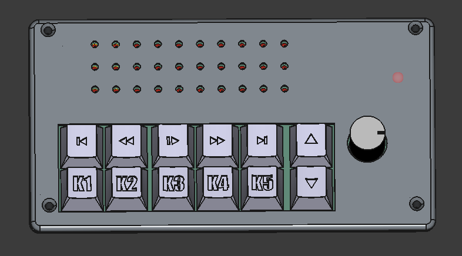
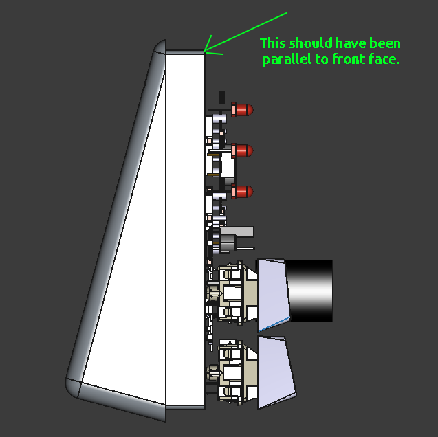
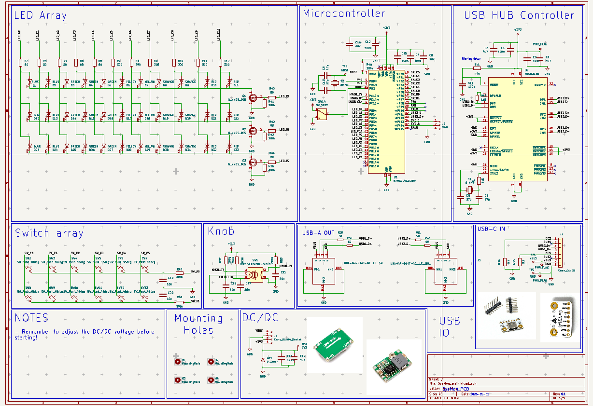
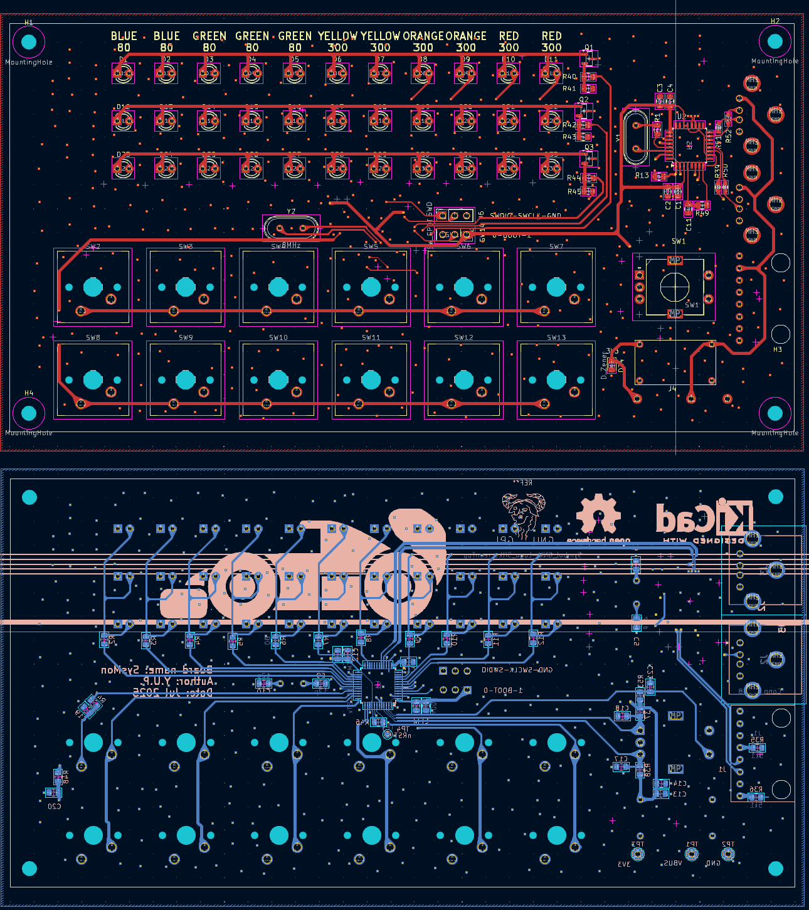

# SysMon
SysMon is a system monitor hardware it has three parts
- USB hub
- macro keys and a volume knob as a input (knobs are cool)
- three strips of multiple colours showing CPU/GPU/RAM usage
The project is ongoing.

.
├── CAD: Contains all the CADs related to the project
├── PCB: Contains the PCB files
├── Software: Software used in this project
└── USB-C_dim_xtracn: A overkill exercise to obtain the correct placement of the holes of the USB-C module

## Progress
- CAD: Complete and printed
- PCB: Complete and printed
    - The USB hub is working
    - STM32 is yet to be tested
- Software: In progress

## Mechanical CAD

The CAD is 3D printed. The enclosure is made slanted to appear like a table clock. The angle is chosen such that it will look good just below the main monitor. The SysMon uses standard Cherry MX keys. Custom keys can be used.

Some of the STEPs are taken from other open projects, a sincere thanks to them.

### Log
The CAD has a minor mistake which I noticed after the printing. The inner side of the back body has the wrong angle. Please correct it before printing for yourself. 

## Electronics 
The electronics consists of

- switch matrix
- LED matrix
- volume knob
- Two USB-A upstream port
- USB-C downstream port for connection to PC
- Adjustable step down converter module to power hub
- TI TUSB2036 ASIC based USB hub 
- STM32L412, very low powered microcontroller

The PCB is designed on KiCad. For this design, two layers are sufficient. Mixed routing is used with ground planes on both sides. Small series resistors are added in series to USB downstream bus to prevent ESD issues. Array scanning is used for switches and row scanning is used for LED lighting.

This hub is not externally powered, take care of what you are plugging in.  The USB-C bus power is set to maximum by pulling CC pins down by 5.1 kOhm (refer USB-C specifications  ))

### Log
- The footprint of the module is not correct. Workaround by jumpers and cutting traces is performed.
- The NRST pint is given a test-point only. It is causing discomfort while programming and testing. Please combine it with SWD programmer pins. 
